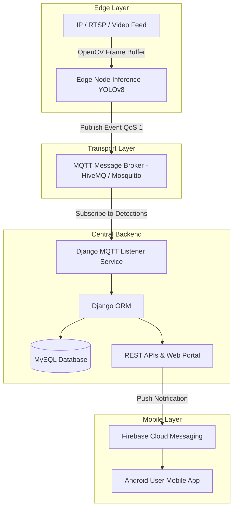

# 🐾 WildEye: Edge AI & IoT Wildlife Intrusion Prevention System

<div align="center">
  
</div>

<br/>

<div align="center">
  
  
  
  
  
  
  
  
  <br/>
  <a href="https://github.com/iamfebin"></a>
  <a href="https://linkedin.com/in/iamfebin"></a>
</div>

<br/>

> **An end-to-end intelligent IoT & Edge Computer Vision platform designed for real-time wildlife intrusion detection, automated sonic deterrence, and instant alert dispatch to mitigate Human-Wildlife Conflict (HWC).**

---

## ✨ Highlights & Capabilities

- 🎯 **Edge Object Detection**: Custom-trained **YOLOv8** model running over OpenCV frame buffers for real-time wildlife detection across RTSP streams, local video files, and webcams.
- 🔊 **Automated Sonic Deterrents**: Localized acoustic deterrent triggers upon detection to turn away animals before boundary breaches occur.
- 📡 **Event-Driven MQTT Telemetry**: High-throughput, low-latency publish/subscribe pipeline for real-time camera heartbeats and intrusion payloads.
- 🖥️ **Central Django Management Portal**: Web dashboard providing live camera monitoring, incident logs, database management, and administrative control.
- 📱 **Android User Mobile App**: Empowers public users and local communities to receive real-time FCM intrusion alerts and officer curfew notices, report/post animal sightings, submit eco-trekking requests, view dangerous wildlife hazard zones on interactive maps, and find nearest forest station contact details.
- 🎛️ **Web Launcher GUI**: A web interface ([tools/web_launcher.py](tools/web_launcher.py)) to run the detection script on a camera feed, video, or image file.

---

## 🏗️ System Architecture



### Core Components
1. **Edge Inference Engine (`edge_node/`)**: Lightweight YOLOv8 detector (`best.pt`) processing frame buffers, triggering localized sound deterrents, and publishing telemetry.
2. **MQTT Telemetry Bus**: Event-driven broker decoupling edge cameras from central storage and processing.
3. **Django Central Backend (`backend/`)**: Main system portal receiving telemetry streams, logging incidents into MySQL, rendering real-time web dashboards, and managing camera nodes.
4. **Android Mobile Application**: Integrated with FCM to receive intrusion alerts & officer curfew notices. Enables community users to report animal sightings, submit trekking requests, view high-risk hazard zones, and locate nearest forest stations.
5. **Edge Launcher GUI (`tools/web_launcher.py`)**: Web interface to run the detection script on a camera feed, video, or image file.

---

## 💻 Tech Stack

| Domain | Technologies |
| :--- | :--- |
| **Backend & APIs** | Python 3.10+, Django 5.x, Django REST Framework, Flask |
| **AI & Computer Vision** | Ultralytics YOLOv8, PyTorch, OpenCV (`cv2`) |
| **IoT & Messaging** | Paho MQTT, MQTT Broker (HiveMQ / Mosquitto), WebSockets |
| **Database** | MySQL 8.0+, Django ORM |
| **Mobile Integration** | Firebase Cloud Messaging (FCM), Android SDK |
| **Engineering Quality** | Ruff, Bandit, Pip-audit, Automated Launch Scripts |

---

## ⚡ Quickstart Guide

### 1. Clone & Configure Environment

```bash
git clone https://github.com/iamfebin/wildeye-web.git
cd wildeye-web

# Copy environment file blueprint
copy .env.example .env   # On Windows
cp .env.example .env     # On Linux / macOS
```

Ensure your local MySQL database is running and update `DB_NAME`, `DB_USER`, and `DB_PASSWORD` in `.env`.

### 2. One-Click Launch

Run the automated startup script to create virtual environments, install dependencies, execute migrations, start the MQTT listener daemon, and launch the web portal:

```cmd
# Windows
start.bat
```

```bash
# Linux / macOS
chmod +x start.sh && ./start.sh
```

The Django portal will be accessible at `http://127.0.0.1:8000`.

<details>
<summary>🛠️ Manual Setup Instructions (Click to expand)</summary>

```bash
# 1. Virtual Environment & Dependencies
python -m venv venv
source venv/bin/activate  # venv\Scripts\activate on Windows
pip install -r requirements.txt

# 2. Database Migrations & Web Server
python backend/manage.py migrate
python backend/manage.py runserver 0.0.0.0:8000

# 3. MQTT Subscriber Daemon (in a new terminal)
python backend/manage.py run_mqtt_subscriber
```
</details>

---

## ⚙️ Execution & Utilities

- **Run Detection Script directly (CLI)**:
  ```bash
  python edge_node/animal_using_video.py --camera-id 1 --camera-source 0
  ```
- **Detection Web Launcher (GUI)**:
  *(Web interface to run detection on a camera feed, video, or image file)*
  ```bash
  python tools/web_launcher.py
  ```
  *(Access at `http://127.0.0.1:5000`)*
- **Simulate Detection Events**:
  ```bash
  python tools/mqtt_test_publisher.py
  ```

---

## 📁 Repository Structure

```text
wildeye/
├── backend/                     # Django Web Portal, ORM models, and MQTT listener service
├── edge_node/                   # YOLOv8 Computer Vision engine, audio deterrence, & MQTT client
├── tools/                       # Web GUI node launcher & MQTT event publisher simulator
├── docs/                        # Architecture diagrams & visual assets
├── start.bat                    # One-click Windows startup script
├── start.sh                     # One-click Linux/macOS startup script
├── .env.example                 # Environment variable template
├── requirements.txt             # Core production dependencies
└── LICENSE                      # MIT Open Source License
```

---

## 🔮 Future Roadmap & Potential Enhancements

- 📡 **Multi-Sensor Edge Expansion**: Scaling edge nodes with multi-modal sensor arrays (PIR motion detectors, thermal cameras, seismic ground vibration sensors, and micro-radar).
- 🔊 **Targeted & Species-Specific Deterrents**: Advancing acoustic deterrence with species-tuned ultrasonic frequencies and adaptive sound profiles targeting specific animals.
- 💨 **Automated Non-Lethal Countermeasures**: Integrating hardware relay actuators for automated deployment of localized non-lethal deterrents (e.g., eco-friendly repellent misters, water cannons, or irritant sprayers) upon positive identification.

---

## 📜 License & Author

Distributed under the [MIT License](LICENSE). 

Designed & Developed by **Febin Babu**
- 🐙 **GitHub**: [github.com/iamfebin](https://github.com/iamfebin)
- 💼 **LinkedIn**: [linkedin.com/in/iamfebin](https://linkedin.com/in/iamfebin)

